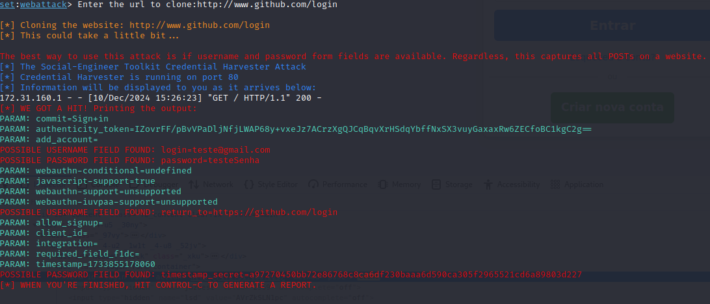

# Phishing para captura de senhas do Github

### Ferramentas

- Kali Linux
- setoolkit

### Configurando o Phishing no Kali Linux

- Acesso root: ``` sudo su ```
- Iniciando o setoolkit: ``` setoolkit ```
- Tipo de ataque: ``` 1 - Social-Engineering Attacks ```
- Vetor de ataque: ``` 2 - Web Site Attack Vectors ```
- Método de ataque: ``` 3 - Credential Harvester Attack Method ```
- Método de ataque: ``` 2 - Site Cloner ```
- Obtendo o endereço da máquina: ``` ifconfig ```
- URL para clone: http://www.github.com/login

### Resutados



### Alterando o site clonado
- Acessar o diretório onde o site é armazenado ``` cd /root/.set ```
- Remover os arquivos ``` rm -rf web_clone/* ```
- Repetir o processo de configuração do phishing alterando a url do site a ser clonado